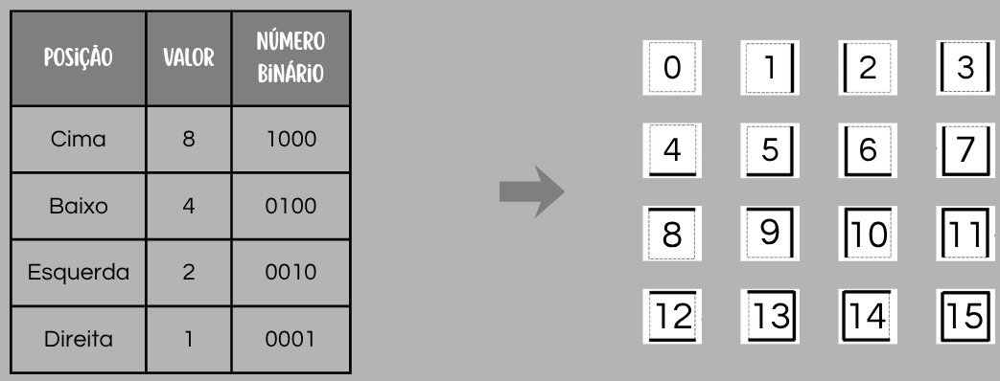
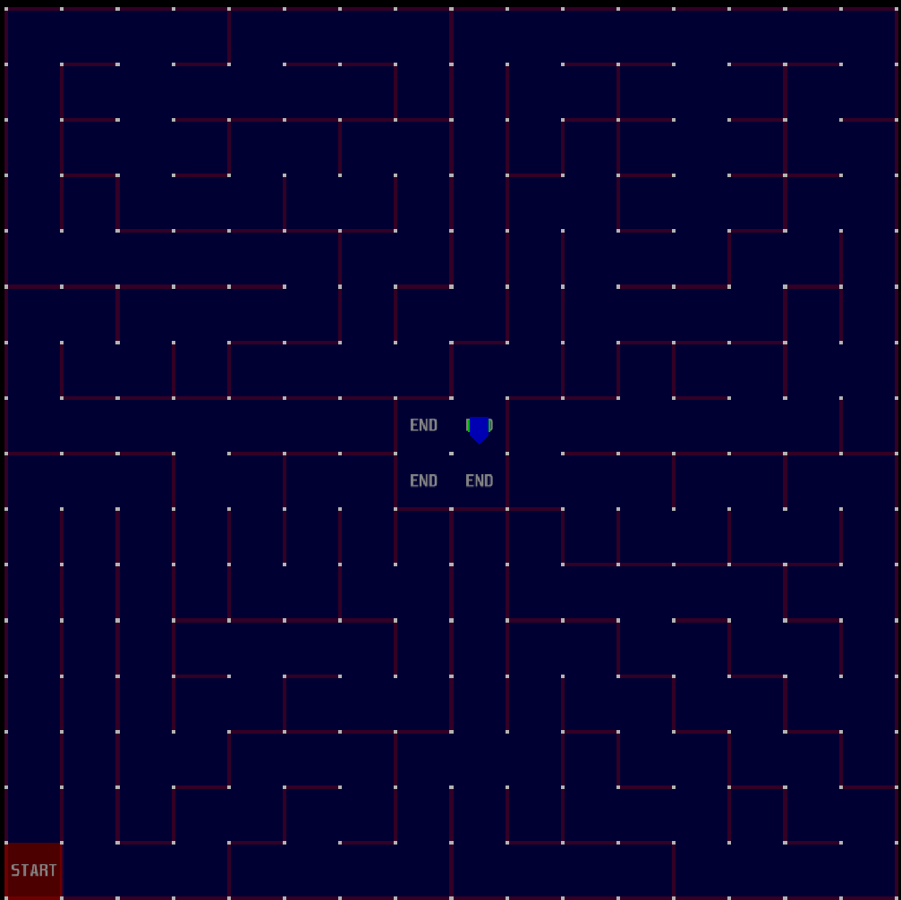
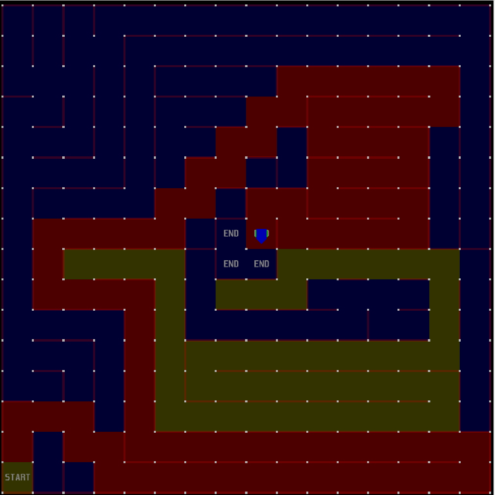

# Algoritmo Floodfill para Micromouse

Esse é um respositório de um algoritmo floodfill feito utilizando busca em largura para o simulador de micromouse para o nosso projeto da cadeira de programação da Poli-UPE.

----

    Passo 1 - Construir uma matriz 16x16 do labirinto

    Passo 2 - Ajuste da matriz de acordo com o começo de onde o micromouse iniciou

    Passo 3 - Mapeamento de toda a matriz

    Passo 4 - Robô registra as paredes do local na matriz**

    Passo 5 - Atualiza a Matriz de "Inundação" para a volta*

Loop enquanto o robô não volta ao início:
    
    Passo 6 - Pega a Matriz de Inundação e busca o menor número adjascente, considerando as paredes ao seu lado

Loop enquanto o robô não chegar ao 0 na Matriz de Inundação para o centro:

    Passo 7 - Robô se move para o menor número da matriz de inundação

    Passo 8 - Robô chega ao destino e para de se mover no simulador

----
obs*: Uma matriz de inundação é como se alguém jogasse água em um lugar que ele quer chegar e a água iria "despejando" pelo labirinto, mas nesse caso a água seria a distância até o lugar que a gente quer da matriz.

Notem que os lugares de chegada tão como 0 e a distância as seguintes dão a distância ideal dela até a celula e vai ser atualizada com base nas paredes que o micromouse vai identificando (considerando que o micromouse não sabe da maioria dessas paredes vermelhas, só a primeira)

obs**: As paredes da matriz seriam ilustradas em representações binárias

    Cima - Baixo - Esquerda - Direita (tanto faz a ordem, na imagem acima tá diferente)
    0 0 0 0 - 0 - sem parede pra nenhum dos lados
    1 0 0 0 - 8 - so tem parede em cima
    0 1 1 1  - 7 -  ele so pode andar pra cima pq é o unico lugar possivel, pq tem paredes em todos os lados

    Versão Python: 3.1x
E é assim que ele termina!

legenda: *azul* = mapeamento, *amarelo* = volta ao inicio, *vermelho* = ida para o centro

Utilizamos a página do medium abaixo como fonte para entendermos melhor como funciona um código para o micromouse!

[Medium](https://medium.com/@minikiraniamayadharmasiri/micromouse-from-scratch-algorithm-maze-traversal-shortest-path-floodfill-741242e8510) 

*Nossos integrantes:*

[Djully](https://github.com/djullycordeiro)

[Giulia](https://github.com/GiuliaSMe)

[Jamerson](https://github.com/jamersonfelix-bot)

[Luis](https://github.com/luisfteixeira11)

[Matheus](https://github.com/matheusfentes)

[Milena](https://github.com/milena-duarte)

[Sofia](https://github.com/sofiaruasm)

[Você pode baixar o simulador por esse link,](https://github.com/mackorone/mms#download)
se quiser testar e ver como funciona utilize o Main.py no simulador, já que é o arquivo principal do nosso código.